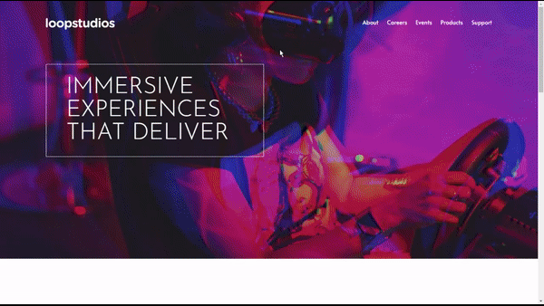
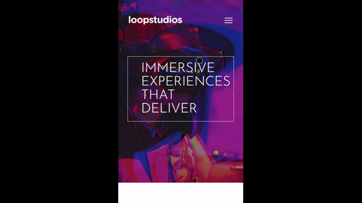

# Loopstudios Landing Page

## Overview

The Loopstudios Landing Page project presents a creative design studio specializing in interactive VR experiences. Built with HTML, CSS, and JavaScript, this landing page emphasizes the studio's cutting-edge projects and services through a sleek, modern interface. Employing the `Alata` and `Josefin Sans` fonts from Google Fonts, the design ensures readability and visual appeal, complementing the immersive theme of virtual reality.

## Features

- **Responsive Design:** The layout adjusts flawlessly across various devices, providing an optimal browsing experience.
- **Interactive Navigation:** A hamburger menu for mobile screens enhances accessibility, revealing a full-page navigation overlay.
- **Elegant Typography:** Uses `Alata` and `Josefin Sans` for a distinct and stylish typeface that aligns with the creative nature of the studio.
- **VR Experience Showcases:** High-quality images and descriptions highlight the studio's expertise in delivering immersive VR projects.
- **Engagement Opportunities:** Integrated contact options and social media links encourage user interaction and connectivity.

## Screenshots





## Setup

To deploy the Loopstudios Landing Page within your environment, follow these steps:

1. **Clone the Repository:**

```bash
git clone https://github.com/Wilmer856/loopstudios-landing-page.git
```

2. **Navigate to the Project Directory:**

```bash
cd loopstudios-landing-page-main
```

3. **Open the `index.html` file in a web browser to view the component.**

## Customization

- **Imagery and Content:** Update the images and text content to reflect your studio's portfolio and service offerings.
- **Style Customization:** Modify the `style.css` file to adjust the color scheme, layout, and typography to fit your brand's identity.
- **Interactive Features:** Enhance the `index.js` file to introduce new interactive elements or improve existing functionalities for a more dynamic user experience.

## Dependencies

- **Google Fonts:** Utilizes [Alata](https://fonts.google.com/specimen/Alata) and [Josefin Sans](https://fonts.google.com/specimen/Josefin+Sans) for its typography.
